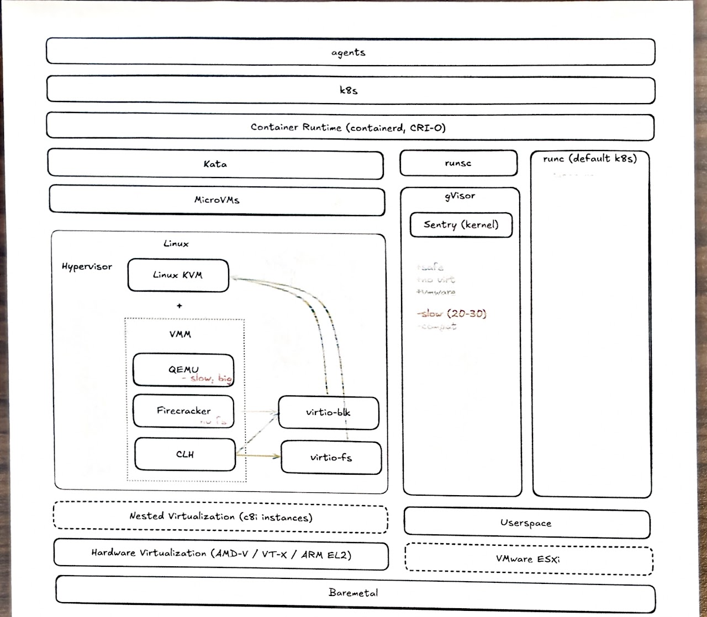
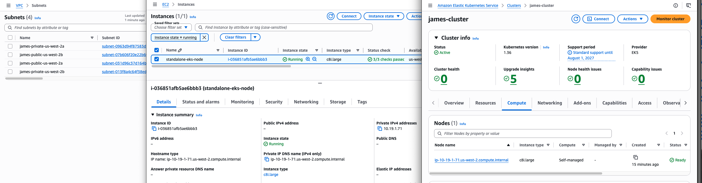

# purpose

this repo is a quick test / demo of running eks with alternative container runtimes (like microVMs with firecracker or cloud hypervisor), or with non-kvm solutions like gvisor.



Sorry I left the original diagram on my home browser's excalidraw localStorage, will update when I get home.

# how to use

apply `terraform/` resources and deploy the vpc, eks cluster, and single worker node (has to be a c8i.large (or metal) or above, otherwise no hardwawre-enabled cpu virtualization for linux kvm). note that nested virtualization is enabled.

apply `kubernetes/` resources to run pod tests to ensure that the pods 1. spin up properly and 2. can properly print their kernel name. don't forget to apply the runtime definitions so that kubernetes knows to pass down these flags to containerd.

```
❯ k get pods
NAME                           READY   STATUS      RESTARTS   AGE
aws-node-9tfs8                 2/2     Running     0          12m
eks-pod-identity-agent-tprkl   1/1     Running     0          12m
kata-clh-hello                 0/1     Completed   0          2m6s
kata-fc-hello                  0/1     Completed   0          119s
kvm-check                      0/1     Completed   0          2m28s
runsc-hello                    0/1     Completed   0          111s
```



# tests

## linux kvm + vmm (microvms)

if access to baremetal is possible (i.e. enabling bios virtualization flags), or nested virtualizaton is psosible, then the linux kvm is the most performant option. this is available on c8i (intel) instances, baremetal instances, and on-prem baremetal machines. the following sections document some common vmms (missing qemu, which seems to be going through an indentity crisis right now about if it wants compatibilitymaxx or lightweightmaxx)

these demos using the linux kvm uses kata, which does the magic of turning containerd requests (for spinning up containers) to microvm spin-up calls using the linux kvm + vmm.

### cloud hypervisor

cloud hypervisor has a lot of backing behind it from big names like arm/amd/intel/google, and linux foundation.

```
❯ k logs -f kata-clh-hello
==========================================
🚀 Hello from inside Cloud Hypervisor!
==========================================
My guest microVM kernel is: 6.18.35
==========================================
```

### firecracker

firecracker is also a vmm, started at aws, lacks virtio-fs support, harder to setup and requires manually mapping thin pools for block storage (see userdata scripts)

due to the crazy block storage setup for firecracker, there seems to be some issues with pulling images that are initially fetched as tarballs. containerd's image puller seems to discard the tarball as soon as it's unarchived, rather than passing it along to block storage. if your container won't start and the `k describe` status is 'i can't find the tarball', then try manually pulling that image. not sure how to solve this yet.

```
# manually pull if cached without tarball
sudo ctr -n k8s.io images pull --local --snapshotter devmapper --platform linux/amd64 docker.io/library/alpine:latest

❯ k logs -f kata-fc-hello
==========================================
🚀 Hello from inside Firecracker!
==========================================
My guest Firecracker microVM kernel is: 6.18.35
==========================================
```

## gvisor

gvisor doesn't use kvm at all. it provides its own kernel to run in the userspace. it may not be as fully featured as the linux kvm, but it should have enough compatibility for most basic workloads. also ~20% slower depending on the workload compared to native kernel performance. can run on non-virtualize-enabled environments like vmware esxi for on-prem deployments.

gvisor does not use kata, but instead replaces it (by replacing `runc` like kata does) using `runsc` (s for Sentry, i presume).

```
❯ k logs -f runsc-hello
==========================================
🚀 Hello from inside gvisor!
==========================================
My guest gvisor kernel is: 4.19.0-gvisor
==========================================
```
